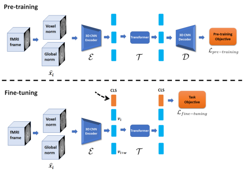

#Pre-training and Fine-tuning Transformers for fMRI Prediction Tasks
This repo is the implementation for [**TFF**](https://arxiv.org/abs/2112.05761v1). 


<p align="center">
    
</p>


&nbsp;
## Contents
- [Datasets](#datasets)
- [Train with our datasets](#training)
- [HyperParameters](#HyperParameters)
- [Cite](#cite)


## Datasets
We currently support the following datasets
* HCP - human connectome project S1200
  * Register at (https://db.humanconnectome.org/)
  * Download: WU-Minn HCP Data - 1200 Subjects -> Subjects with 3T MR session data -> Resting State fMRI 1 Preprocessed
  * Preprocess the data by configuring the folders and run 'data_preprocess_and_load/preprocessing.main()'
    
* ucla (Consortium for Neuropsychiatric Phenomics LA5c Study) 
  * Original version available at (https://openneuro.org/datasets/ds000030/versions/00016)
  * Data after proprocessing will be added soon, for now can download original and preprocess indiependently.


# Training
* For gender prediction run 'python main.py --dataset_name S1200 --fine_tune_task binary_classification'
* For age prediction run 'python main.py --dataset_name S1200 --fine_tune_task regression'
* For schezophrenia prediction run 'python main.py --dataset_name ucla --fine_tune_task binary_classification'

## Tensorboard support
All metrics are being logged automatically and stored in
```
TFF/runs
```
Run `tesnroboard --logdir=<path>` to see the the logs.

# HyperParameters
In the future will be added the exact hyperparameters to reproduce results from the paper.


# Citing & Authors
If you find this repository helpful, feel free to cite our publication -

 TFF: Pre-training and Fine-tuning Transformers for fMRI Prediction Tasks
 ```
@misc{2112.05761,
Author = {Itzik Malkiel and Gony Rosenman and Lior Wolf and Talma Hendler},
Title = {Pre-training and Fine-tuning Transformers for fMRI Prediction Tasks},
Year = {2021},
Eprint = {arXiv:2112.05761},
}
 ```

Contact: [Gony Rosenman](mailto:gonyrosenman@mail.tau.ac.il), [Itzik Malkiel](mailto:itzik.malkiel@microsoft.com).
